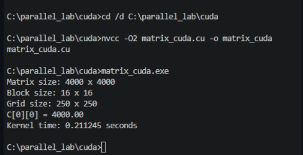

# CUDA Matrix Multiplication

## Purpose

This version moves the matrix multiplication onto an **NVIDIA GPU** using CUDA.

The kernel maps a logical thread to an output position `(row, col)`:

```text
row = blockIdx.y × blockDim.y + threadIdx.y
col = blockIdx.x × blockDim.x + threadIdx.x
```

Each thread computes one output element of `C` by accumulating the inner product across `k`.

## Execution Configuration

For `N = 4000` the recorded configuration is:

```text
Block = 16 × 16 threads
Grid  = 250 × 250 blocks
```

So each block contains 256 threads, and the 2D grid covers the 4000 × 4000 output positions.

## Compile and Run

```bash
nvcc -O2 matrix_cuda.cu -o matrix_cuda
```

Windows CMD:

```bat
matrix_cuda.exe
```

Linux:

```bash
./matrix_cuda
```

## Recorded Result

From the supplied CUDA result screenshot:

```text
Matrix Size = 4000 x 4000
Grid Size = 250 x 250
Block Size = 16 x 16
Kernel time = 0.211245 seconds
Verification C[0][0] = 4000.00
```

### Measurement note

The screenshot used for this repository shows the **kernel execution time**. The program also calculates a separate total CUDA phase, but that value is not visible in the supplied screenshot, so the root comparison explicitly labels the CUDA result as kernel-only.

Relative to the recorded sequential time, the visible kernel time corresponds to approximately:

```text
339.308583 / 0.211245 ≈ 1606.23×
```

This is a kernel-time comparison, not a claim that the complete end-to-end CUDA run takes only 0.211245 seconds.

## Evidence


