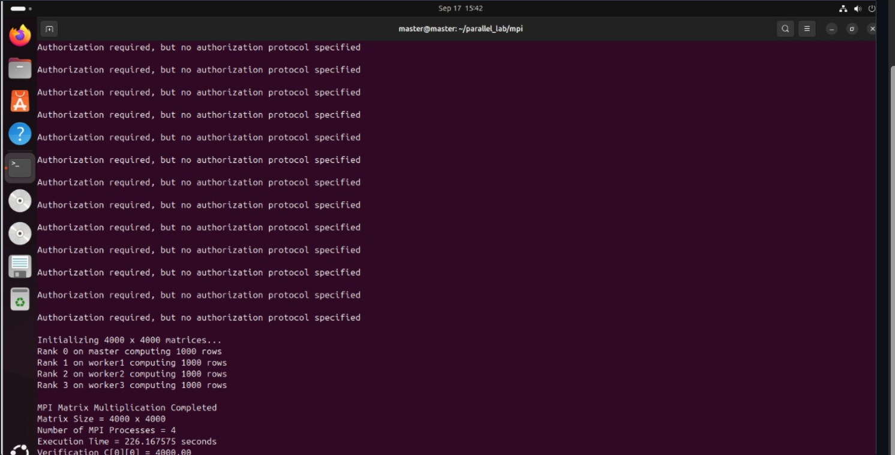

# MPI Matrix Multiplication

## Purpose

This version demonstrates **distributed-memory parallelism** using MPI across four processes.

The experiment follows the lab-manual design of one Master process and three Worker processes. For a 4000-row matrix:

```text
Rank 0 → 1000 rows
Rank 1 → 1000 rows
Rank 2 → 1000 rows
Rank 3 → 1000 rows
```

## MPI Data Flow

```text
Matrix A
   │
   ├── MPI_Scatter ──→ each rank receives 1000 rows
   │
Matrix B
   │
   └── MPI_Bcast ───→ every rank receives full B

Each rank computes local_C
        │
        └── MPI_Gather ──→ complete C on Rank 0
```

The separate processes do not share one common address space. Therefore, communication is required to distribute input data and collect the partial results.

## Compile and Run

Compile on the Master VM:

```bash
mpicc -O2 matrix_mpi.c -o matrix_mpi
```

Copy the executable to the Workers:

```bash
scp matrix_mpi worker1:~/matrix_mpi
scp matrix_mpi worker2:~/matrix_mpi
scp matrix_mpi worker3:~/matrix_mpi
```

Run four processes using the hostfile:

```bash
mpirun -np 4 --hostfile hosts sh -c '$HOME/matrix_mpi'
```

`hosts.example` provides the four-node layout used for the experiment.

## Recorded Result

```text
Matrix Size = 4000 x 4000
Number of MPI Processes = 4
Execution Time = 226.167575 seconds
Verification C[0][0] = 4000.00
```

Relative to the recorded sequential run:

```text
339.308583 / 226.167575 ≈ 1.50×
```

The measured time includes the MPI communication present in the program, including distribution and collection of matrix data.

## Evidence


