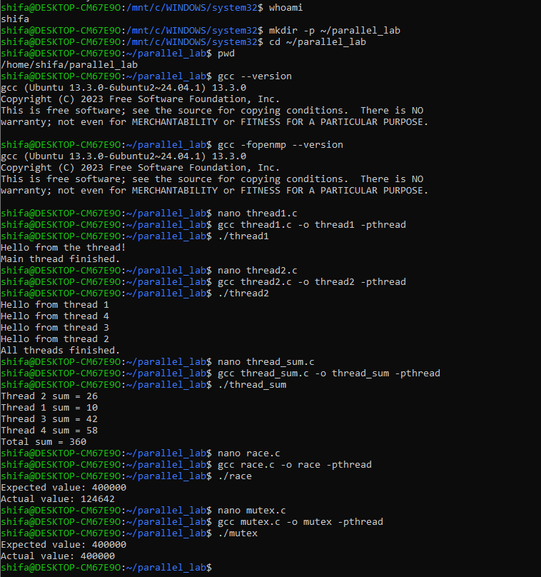
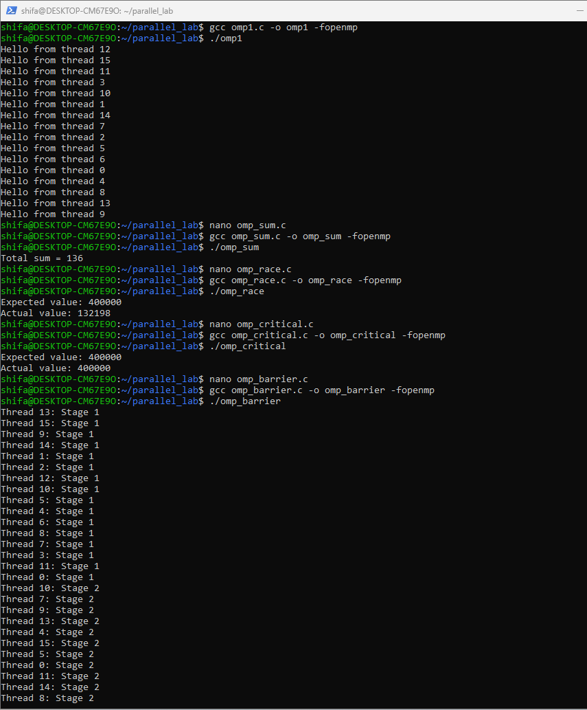
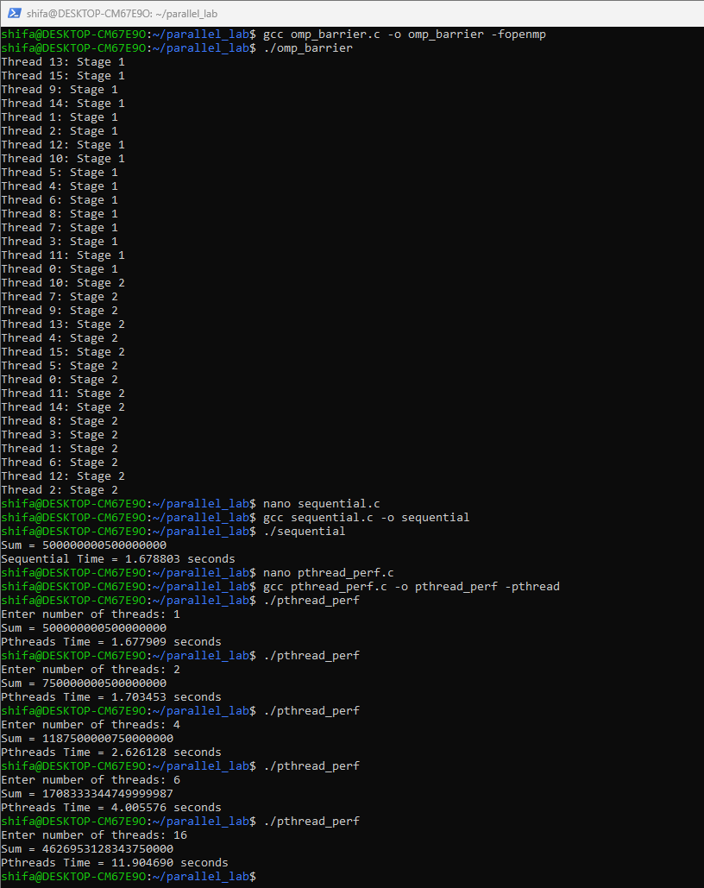
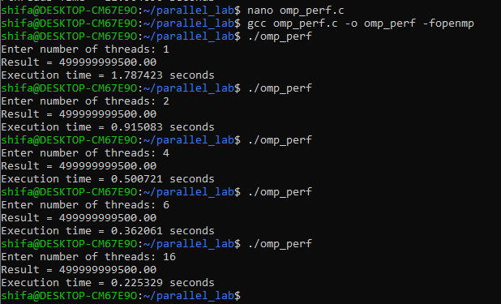

# Multithreaded Programming Using Pthreads and OpenMP

## Overview

This experiment demonstrates multithreaded programming using Pthreads and OpenMP. The experiment covers thread creation, multiple threads, work distribution, race conditions, synchronization, barriers, and performance analysis.

The experiment also compares the execution performance of Pthreads and OpenMP using different numbers of threads.

---

## Problem Definition

A sequential program executes the complete computation using a single thread. Multithreading allows the workload to be divided among multiple threads so that different parts of the computation can execute concurrently.

The experiment demonstrates how threads are created and managed using Pthreads and OpenMP, how race conditions occur when shared data is accessed without synchronization, and how synchronization mechanisms can be used to obtain correct results.

The performance of Pthreads and OpenMP is measured using different thread counts and compared using execution time, speedup, and efficiency.

---

## Experiment Objective

The main objectives of this experiment are:

- To understand thread creation and management.
- To create and execute multiple threads using Pthreads.
- To divide work among multiple threads.
- To understand race conditions.
- To solve race conditions using synchronization.
- To understand OpenMP parallel regions.
- To perform work sharing using OpenMP.
- To understand critical sections and barriers.
- To measure execution time for different thread counts.
- To compare Pthreads and OpenMP performance.
- To calculate speedup and efficiency.

---

## Implementations

| Implementation | Purpose |
|---|---|
| `thread1.c` | Create and execute one thread |
| `thread2.c` | Create and execute multiple threads |
| `thread_sum.c` | Divide work among multiple threads |
| `race.c` | Demonstrate race condition |
| `mutex.c` | Solve race condition using mutex |
| `omp1.c` | Demonstrate OpenMP parallel region |
| `omp_sum.c` | Perform work sharing using OpenMP |
| `omp_race.c` | Demonstrate OpenMP race condition |
| `omp_critical.c` | Synchronize using OpenMP critical section |
| `omp_barrier.c` | Coordinate threads using OpenMP barrier |
| `sequential.c` | Sequential performance baseline |
| `pthread_perf.c` | Measure Pthreads performance |
| `omp_perf.c` | Measure OpenMP performance |

---

## Recorded Results

### Pthreads Programs

The Pthread program produced:



The actual value is different from the expected value because multiple threads update the shared variable without synchronization.

---

### OpenMP Programs

The OpenMP parallel program executed using multiple threads and displayed thread IDs.

The program used 16 threads in the recorded execution.



---

## Performance Results

The sequential program was used as the baseline.

### Pthreads

| Number of Threads | Execution Time (seconds) |
| ----------------- | ------------------------ |
| 1                 | 1.677909                 |
| 2                 | 1.703453                 |
| 4                 | 2.626128                 |
| 6                 | 4.005576                 |
| 16                | 11.904690                |

### OpenMP

| Number of Threads | Execution Time (seconds) |
| ----------------- | ------------------------ |
| 1                 | 1.787423                 |
| 2                 | 0.915198                 |
| 4                 | 0.500721                 |
| 6                 | 0.326061                 |
| 16                | 0.225329                 |


---

## Speedup Calculation

Speedup is calculated using:

> Speedup = Sequential Time / Parallel Time

Using the sequential execution time of `1.678803 seconds`:

### OpenMP Speedup

| Threads | OpenMP Time (s) | Speedup |
| ------- | --------------- | ------- |
| 1       | 1.787423        | 0.939x  |
| 2       | 0.915198        | 1.835x  |
| 4       | 0.500721        | 3.353x  |
| 6       | 0.326061        | 5.149x  |
| 16      | 0.225329        | 7.450x  |

The highest measured OpenMP speedup was approximately:

**7.45x**

with 16 threads.

### Pthreads Speedup

| Threads | Pthreads Time (s) | Speedup |
| ------- | ----------------- | ------- |
| 1       | 1.677909          | 1.001x  |
| 2       | 1.703453          | 0.986x  |
| 4       | 2.626128          | 0.639x  |
| 6       | 4.005576          | 0.419x  |
| 16      | 11.904690         | 0.141x  |

---

## Efficiency Calculation

Efficiency is calculated using:

> Efficiency = Speedup / Number of Threads × 100

### OpenMP Efficiency

| Threads | Speedup | Efficiency |
| ------- | ------- | ---------- |
| 1       | 0.939x  | 93.90%     |
| 2       | 1.835x  | 91.75%     |
| 4       | 3.353x  | 83.83%     |
| 6       | 5.149x  | 85.82%     |
| 16      | 7.450x  | 46.56%     |

For 16 threads:

```text
Efficiency = 7.450 / 16 × 100
           ≈ 46.56%
```
---

## Why the Results Differ

The Pthreads and OpenMP results differ because the two implementations use different approaches for managing and distributing work.

OpenMP provides compiler directives and runtime support for thread management, work sharing, synchronization, and reduction.

Pthreads provides lower-level control where thread creation, work distribution, and synchronization are handled explicitly by the programmer.

The recorded results show that OpenMP execution time decreased as the number of threads increased, while the measured Pthreads execution time increased for higher thread counts.

Parallel execution also introduces overhead such as thread management, scheduling, synchronization, and memory access. Therefore, increasing the number of threads does not always produce proportional speedup.

---

### Pthreads Results


### OpenMP Results


### Pthreads Performance



### OpenMP Performance



### Execution Time Graph


### Speedup Graph


### Efficiency Graph


---

## Execution

### Pthreads

Compile the basic programs using:

```bash
gcc thread1.c -o thread1 -pthread
gcc thread2.c -o thread2 -pthread
gcc thread_sum.c -o thread_sum -pthread
gcc race.c -o race -pthread
gcc mutex.c -o mutex -pthread
```
Compile:
```bash
./thread1
./thread2
./thread_sum
./race
./mutex
```

### OpenMP

Compile the basic programming using:

```bash
gcc omp1.c -o omp1 -fopenmp
gcc omp_sum.c -o omp_sum -fopenmp
gcc omp_race.c -o omp_race -fopenmp
gcc omp_critical.c -o omp_critical -fopenmp
gcc omp_barrier.c -o omp_barrier -fopenmp
gcc omp_perf.c -o omp_perf -fopenmp
```

Run them using:

```bash
./omp1
./omp_sum
./omp_race
./omp_critical
./omp_barrier
./omp_perf
```

---
## Repository Structure

```text
Exp2-Multithreads/
├── README.md
├── Pthreads/
│   ├── thread1.c
│   ├── thread2.c
│   ├── thread_sum.c
│   ├── race.c
│   ├── mutex.c
│   └── pthread_perf.c
├── OpenMP/
│   ├── omp1.c
│   ├── omp_sum.c
│   ├── omp_race.c
│   ├── omp_critical.c
│   ├── omp_barrier.c
│   └── omp_perf.c
├── sequential/
│   └── sequential.c
└── results/
    ├── Pthreads.png
    ├── OpenMP.png
    ├── performance_pthread1.png
    └── performance_openmp1.png
```

---

## Verification

The experiment was verified by successfully compiling and executing the Pthreads and OpenMP programs.

The Pthreads programs demonstrated:

- Thread creation
- Multiple threads
- Work distribution
- Race condition
- Mutex synchronization

The OpenMP programs demonstrated:

- Parallel execution
- Work sharing
- Race condition
- Critical section
- Barrier synchronization

The performance programs were executed using 1, 2, 4, 6, and 16 threads.

The sequential execution time was:

```text
1.678803 seconds
```
The best measured OpenMP execution time was:

```bash
0.225329 seconds
```
with 16 threads.

The corresponding measured OpenMP speedup was approximately:

```bash
7.45x
```
---

## Key Observations

1. Pthreads provides explicit control over thread creation and synchronization.
2. OpenMP provides a simpler high-level approach to parallel programming using compiler directives.
3. Race conditions can produce incorrect results when shared data is accessed without synchronization.
4. Mutex synchronization produced the correct expected value of `400000`.
5. OpenMP critical-section synchronization also produced the correct expected value of `400000`.
6. The barrier program demonstrated coordination between different execution stages.
7. OpenMP execution time decreased as the number of threads increased.
8. The best measured OpenMP execution time was `0.225329 seconds` with 16 threads.
9. The measured OpenMP speedup at 16 threads was approximately `7.45x`.
10. The measured Pthreads execution time increased as the number of threads increased.
11. Increasing the number of threads does not always guarantee proportional performance improvement because of parallel overhead.

---

## Conclusion

This experiment provided practical understanding of multithreaded programming using Pthreads and OpenMP.

The Pthreads implementation demonstrated thread creation, multiple threads, work distribution, race conditions, and mutex synchronization.

The OpenMP implementation demonstrated parallel execution, work sharing, race conditions, critical sections, and barrier synchronization.

The performance analysis showed that OpenMP execution time decreased as the number of threads increased. The best measured OpenMP result was `0.225329 seconds` with 16 threads, giving approximately `7.45x` speedup over the sequential execution.

The experiment also demonstrated the importance of synchronization for maintaining correctness when multiple threads access shared data.

Overall, the experiment provided practical understanding of thread management, synchronization, parallel execution, and performance analysis using Pthreads and OpenMP.


